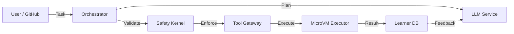

<div align="center">

# RFSN Agent v6.4

### The Autonomous Software Engineer: Hardened, Resilient, Self-Improving

[](https://opensource.org/licenses/MIT)
[](https://www.python.org/downloads/)
[](https://github.com/psf/black)
[](https://github.com/dawsonblock/RFSN-AGENT-FULL)

[Features](#-key-features) • [Architecture](#-architecture) • [Quick Start](#-quick-start) • [Security](#-hardened-security) • [Roadmap](#-roadmap)

</div>

---

## 🚀 Overview

**RFSN (Recursive Feedback & Safety Network)** is a production-grade autonomous coding agent designed to solve complex software engineering tasks. Unlike standard "chat-with-code" tools, RFSN operates as a deterministic, policy-gated system that:

1. **Observes** codebase state via AST-aware context slicing.
2. **Plans** multi-step refactors using MCTS-inspired backtracking.
3. **Executes** changes in isolated, ephemeral sandboxes.
4. **Learns** from every run, building a database of successful repair trajectories.

It is built for **enterprise reliability**, enforcing strict security boundaries (SHH/DRV) and maintaining a cryptographically verifiable audit trail.

## ✨ Key Features (v6.4 Upgrade)

The **Master Upgrade** introduces a complete overhaul of the agent's core faculties:

### 🧠 Cognitive Resilience

- **Trace Recovery**: Automatically recovers from infinite loops and stalled steps using **Frustration Detection**.
- **MCTS Backtracking**: Explicitly rolls back failed attempts to explore alternative solution paths.
- **Speculative Execution**: Parallels execution of multiple patch candidates to find the optimal fix faster.

### 🛡️ Enterprise Security

- **Indirect Injection Firewalls**: Scans all inputs for jailbreak attempts before they reach the planner.
- **Secret Scanning**: Inline SAST prevents API keys and credentials from leaking into patches.
- **Drift Guard (SHH)**: Automatically repairs its own configuration if security settings are tampered with.

### ⚡ Performance & Quality

- **Native Prompt Caching**: Reduces latency and cost by caching prefix states across turns.
- **Semantic Patching**: Uses fuzzy-matching `SemanticPatcher` to apply edits robustly, ignoring minor whitespace differences.
- **AST Locator**: Slices context intelligently, providing the LLM with relevant code skeletons instead of raw files.

### 🔄 The Data Flywheel

- **Trajectory Harvesting**: Captures every thought, action, and result into `learner.duckdb`.
- **DPO Export**: Automatically formats successful runs into Direct Preference Optimization datasets for fine-tuning.
- **RAG Playbooks**: Retrieves historical fix patterns for common errors (e.g., "ImportError", "SyntaxError").

## 🏗️ Architecture

RFSN enforces a strict **Control Plane / Data Plane** separation:



| Service | Role | Key Tech |
| :--- | :--- | :--- |
| **Orchestrator** | The "Cortex". Manages lifecycle and decisions. | Python 3.9+, FastAPI |
| **Safety Kernel** | The "conscience". Validates patches & enforces policy. | Cryptographic Signatures |
| **Executor** | The "hands". Runs code in isolated environments. | Docker, gVisor / MicroVM |
| **Learner** | The "memory". Stores trajectories and strategies. | DuckDB, RAG |

## 🏁 Quick Start

### Prerequisites

- Docker (for sandboxing)
- Python 3.9+
- An LLM Endpoint (Ollama, vLLM, or OpenAI-compatible)

### 1. Hardening Bootstrap

Verify your environment meets security standards:

```bash
python3 scripts/verify_hardening.py
```

### 2. Run a Task

Solve a GitHub issue or local task description:

```bash
python3 -m rfsn_swebench.cli \
    --task "Fix the deadlock in connection_pool.py" \
    --repo_path $(pwd) \
    --model qwen2.5-coder:32b
```

### 3. Full Deployment

Deploy the full microservice mesh:

```bash
docker compose up --build -d
```

## 🔒 Hardened Security

RFSN v6 is designed for **Zero Trust** environments:

- **No Root**: All code runs as non-root users with `no-new-privileges`.
- **Network Airlock**: Sandboxes have no internet access (`network: none`) by default.
- **Audit Ledger**: Every action is hashed and recorded in a tamper-evident ledger.
- **Replay Verification (DRV)**: Cryptographically guarantees that runs are reproducible.

## 🗺️ Roadmap

- [x] **Phase 1-6: The Master Upgrade** (Completed Feb 2026)
- [ ] **Phase 7: Multi-Agent Swarm** (Collaboration between Architect, Coder, and QA agents)
- [ ] **Phase 8: Self-Hosting CI/CD** (Agent manages its own deployment pipeline)

## 📄 License

MIT © 2026 RFSN Project.
